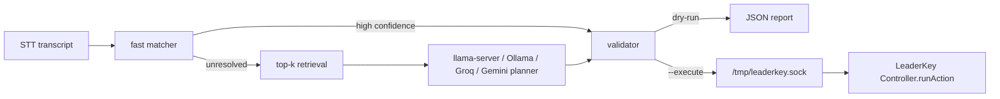

# LeaderKey Voice Dispatcher Architecture

## Pipeline



The dispatcher assumes speech-to-text already produced a transcript. It does not record audio and it does not add menu-bar UI.

## Catalog

`@leaderkey/dispatcher-core` reuses `@leaderkey/config-core` for live config discovery, fallback merging, normal-mode merging, labels, and existing flattened records. The default catalog is:

- frontmost app regular config, including fallback items when an app config exists
- regular fallback when no app config exists
- frontmost normal-mode config, including normal fallback items when present
- normal fallback when no normal app config exists

Global config is available with `--scope global` or `--include-global`.

## Planning

The fast path is deterministic: aliases, BM25-like token scoring, and fuzzy matching over materialized action text. It returns immediately for one action at confidence `>= 0.92`, or a chain when every clause is `>= 0.85` with enough top-result margin.

The LLM planner is fallback-only. It receives only retrieved candidates, never the whole action catalog. This keeps prompt prefill small and prevents choosing IDs outside the retrieved set.

Production-oriented local planner path is `llama-server` with GBNF grammar. Ollama is kept as a developer fallback. Groq, Gemini, OpenAI, OpenRouter, Fireworks, Together, DeepInfra, and Perplexity are supported cloud planner paths for complex voice commands; all still receive only retrieved candidates. Verified model candidates:

- [Qwen2.5-1.5B-Instruct-GGUF](https://huggingface.co/Qwen/Qwen2.5-1.5B-Instruct-GGUF)
- [Phi-3.5-mini-instruct](https://huggingface.co/microsoft/Phi-3.5-mini-instruct)
- [gemma-3-4b-it](https://huggingface.co/google/gemma-3-4b-it)

`llama-server` grammar support is documented in [llama.cpp](https://github.com/ggml-org/llama.cpp).

## Commands

```sh
leaderkey-dispatcher plan --catalog fixtures/actions.json "duplicate tab and copy current url" --pretty
leaderkey-dispatcher execute --catalog fixtures/actions.json "run confetti" --dry-run --pretty
leaderkey-dispatcher bench --catalog fixtures/actions.json --dataset fixtures/bench.jsonl --pretty
```

For local `llama-server`, start a GGUF model with grammar-capable llama.cpp, then use:

```sh
leaderkey-dispatcher plan --planner llama --llama-url http://localhost:8080 "duplicate tab and copy current url"
```

For Ollama development, create or pull a small local model first, then pass its local name:

```sh
leaderkey-dispatcher plan --planner ollama --model qwen2.5:1.5b-instruct --ollama-url http://localhost:11434 "kill tab"
```

Ollama is useful for iteration, but `llama-server` remains the production-oriented path because it supports grammar-constrained output.

For Gemini API planning, save a Gemini API key in Voice settings or pass it directly:

```sh
leaderkey-dispatcher plan --planner gemini --gemini-api-key "$GEMINI_API_KEY" --model gemini-2.5-flash "open intellij and then open terminal in it"
```

For OpenRouter, Fireworks, Together, DeepInfra, Perplexity, OpenAI, or a custom OpenAI-compatible endpoint, use the matching planner kind and API key flag. The custom path accepts `--planner compatible --planner-base-url <url> --openai-api-key <key>`.
